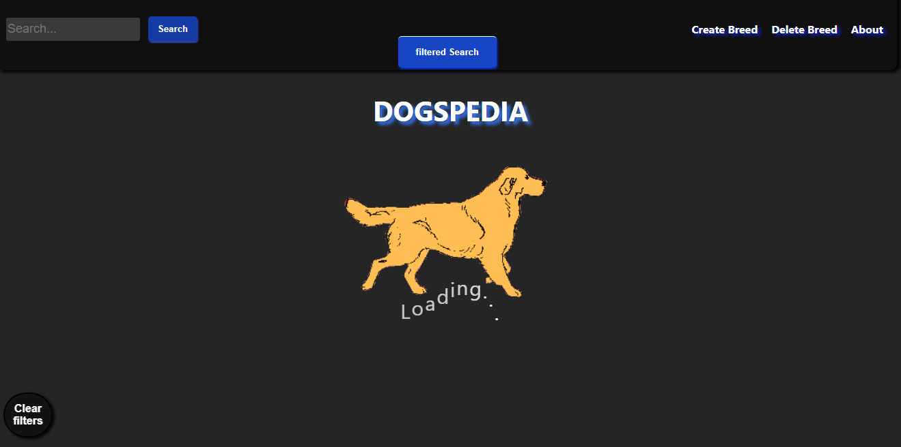
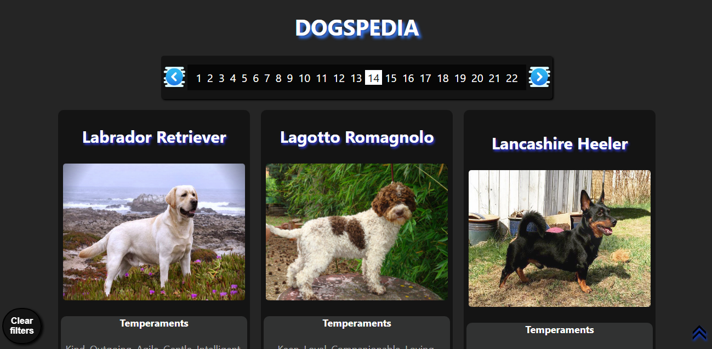
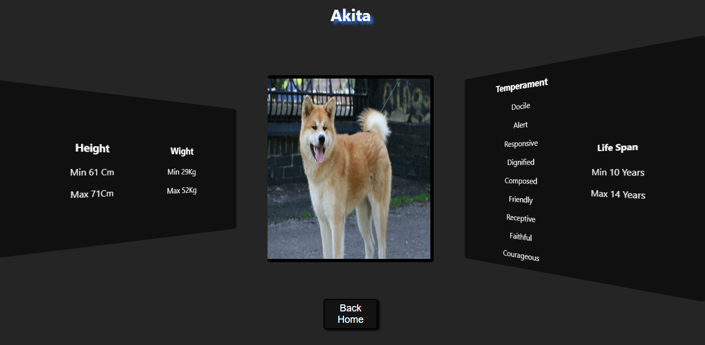
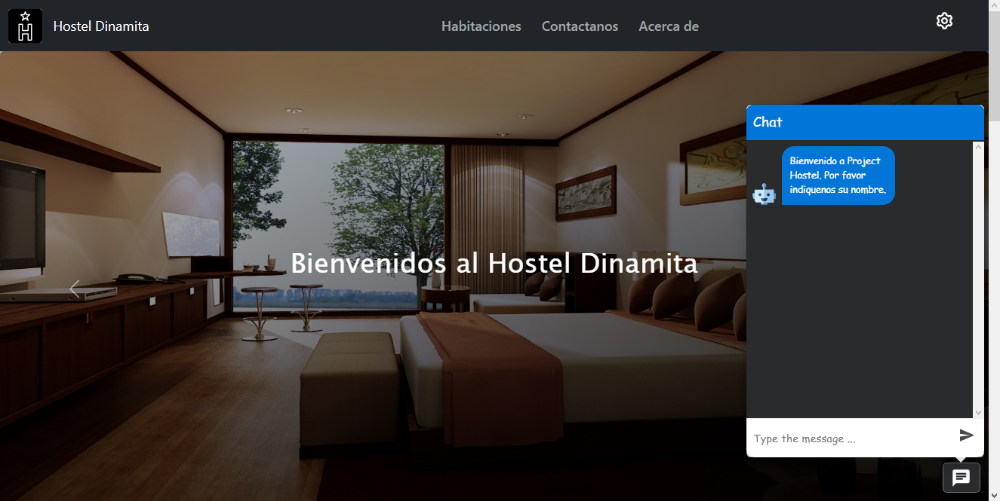

<h1 align="center">
 Full Stack Developer 
</h1>

👋 Hello! I'm Miguel, a Full Stack Web Developer with over a year of experience in a Mexican company. Since an early age, I've been deeply involved in the world of technology, fueled by my passion for video games🕹️ and computers💾. My interest in cybersecurity turned into a hobby, and as I delved deeper, I embarked on a self-taught journey into programming.

I decided to formalize my passion for coding by joining Henry's intensive bootcamp📚, where I immersed myself in the Full Stack Developer career path. Though the road wasn't easy, I'm proud of the progress I've made and the projects I've worked on during my career.

What sets me apart? 🙋‍♂️
♦ My ability to creatively and effectively solve problems, honed through my professional experience.
♦ My capacity to adapt to different roles within a team, allowing me to contribute effectively to multidisciplinary projects.
♦ My commitment to continuous learning, keeping me updated on the latest technologies and industry trends.

I'm excited about the opportunity to continue growing as a professional and contribute my skills to challenging projects.

## ✨ Skills ✨

## ✨ Projects ✨

<a href="https://github.com/kripto-c/Proyecto-individual-29C">🔥 DogPedia 🔥</a>
 
<a href="https://dogpedia-henna.vercel.app">🐶 Visit site 🐶</a>

<a href="https://github.com/kripto-c/HostelProject">🏢 Hostel Project 🏢</a>
 
<a href="https://hostel-project.vercel.app">🏝 Visit site 🏖</a>

## ✨ GitHub Stats ✨

&nbsp;

### Contact 💼

Correo 

 
Linkedin 

