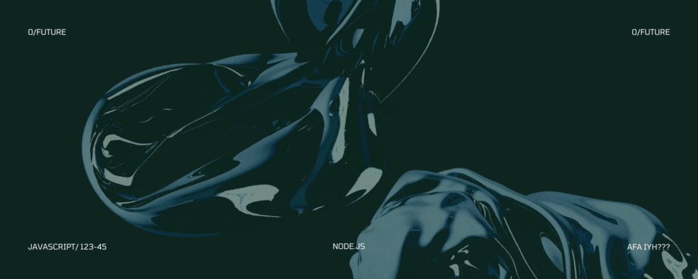

<h1 align="center">
 Full Stack Developer
</h1>

🚀 Full Stack Developer | Problem Solver | Tech Enthusiast
1.5+ Years Delivering Scalable Solutions

Passionate about technology since childhood, I evolved from gaming mods 🎮 to building secure web systems 🔐. Formalized my self-taught journey through 700+ intensive hours at Henry Bootcamp, mastering modern stacks (React, Node.js, PostgreSQL). Currently driving impact at a Mexican tech firm by:

Spearheading full-cycle development of banking loan management systems used by 500+ clients

Optimizing query speeds by 25% through advanced database indexing

Architecting solutions with React/Redux + Node.js/FeathersJS deployed via Docker

Why Collaborate With Me?
✅ Creative Problem-Solving: Turn complex requirements into lean code (4.8/5 project evaluations)
✅ Adaptive Team Player: Successfully pivoted between frontend/backend roles in 3 cross-functional teams
✅ Continuous Learner: 42% faster onboarding of new tech (GraphQL, Twilio) through structured upskilling

Fueled By
🌱 "The best code is written with curiosity" – Thrive in Agile environments pushing tech boundaries
🎯 Seeking: High-impact projects requiring JS expertise & scalable architecture design

## ✨ Skills ✨

## ✨ Projects ✨

<h3>E22 Admin</h3>

<a href="https://e22.mx">>>> Visit company page <<<</a>

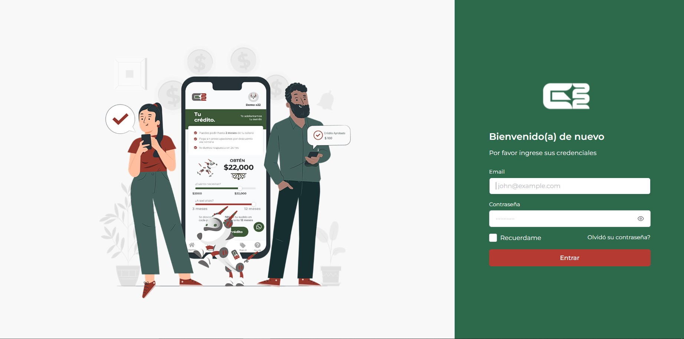
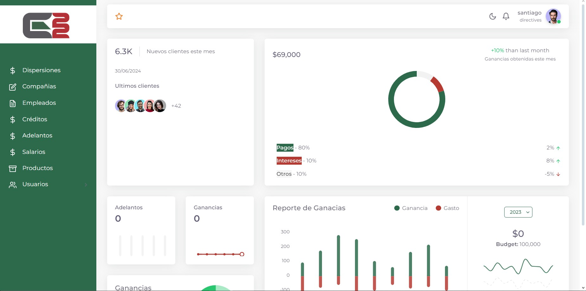
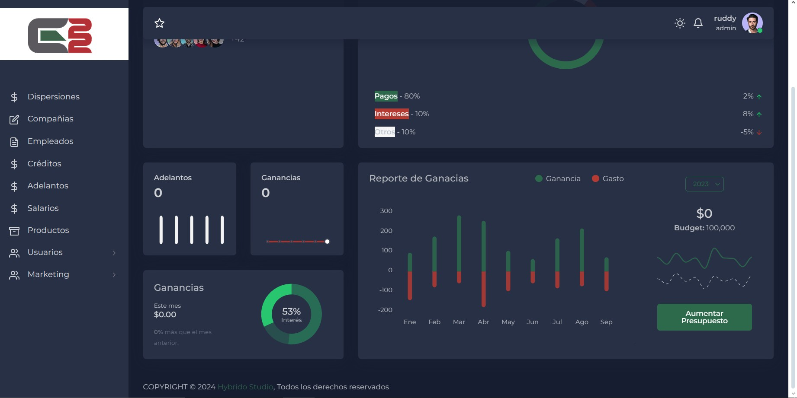
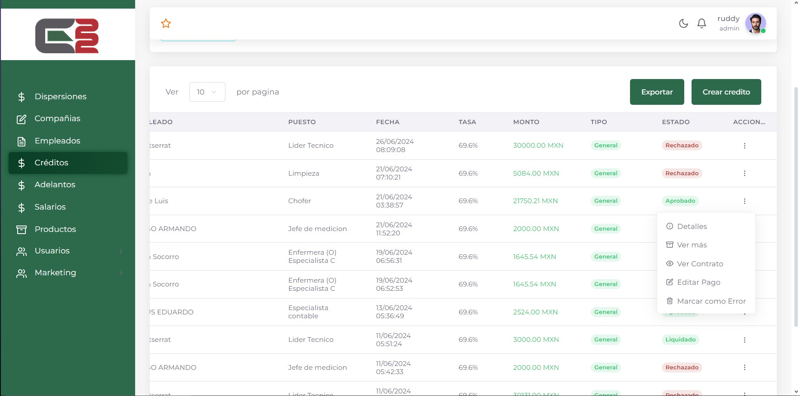
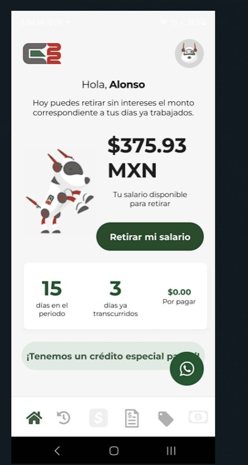
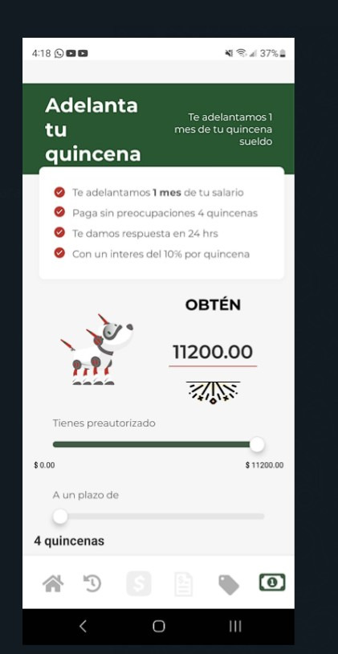

<h3>Mantenimiento SAG </h3>
 

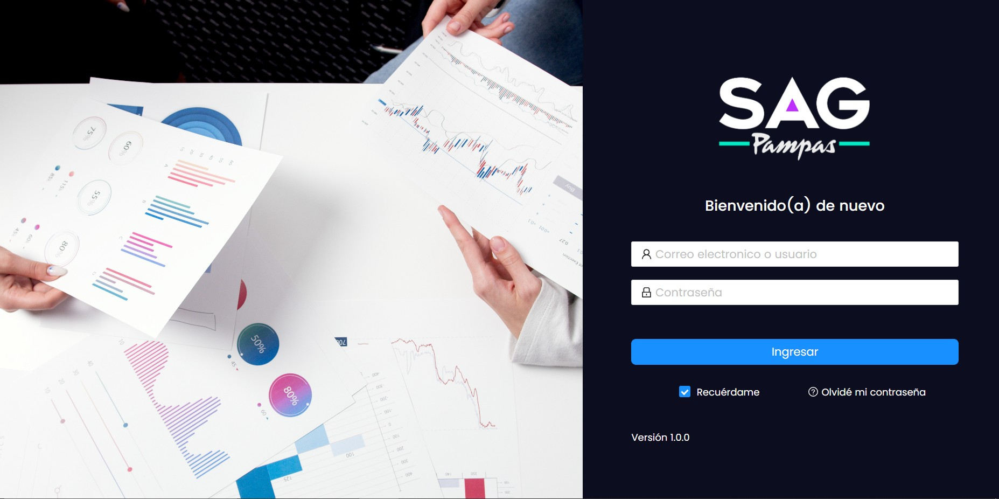
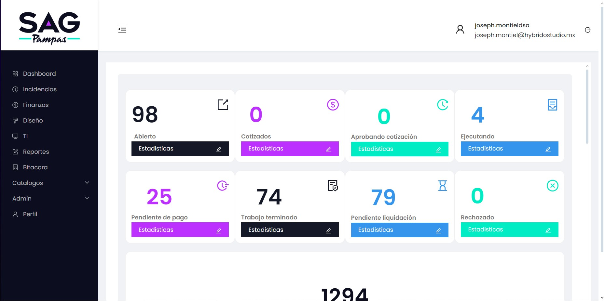
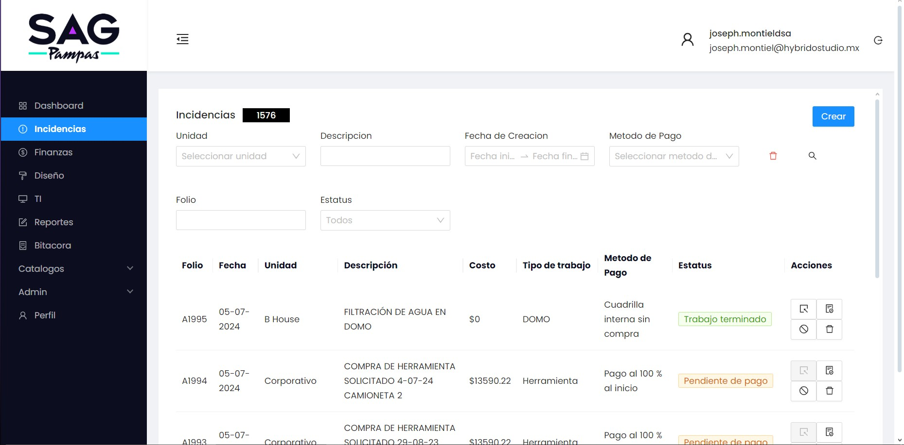
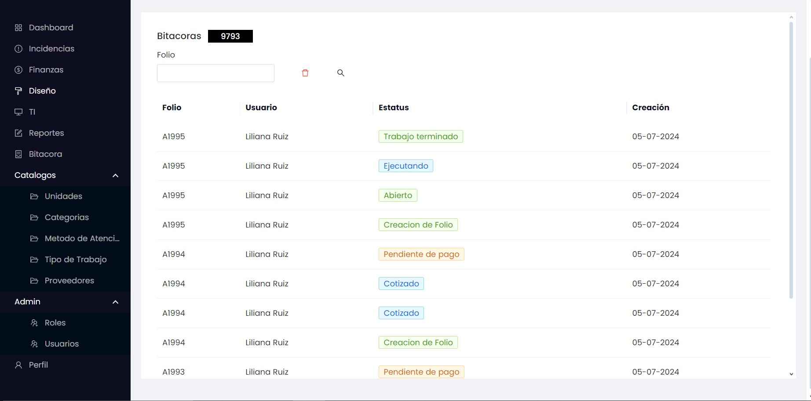

<h3>Factos</h3>
 

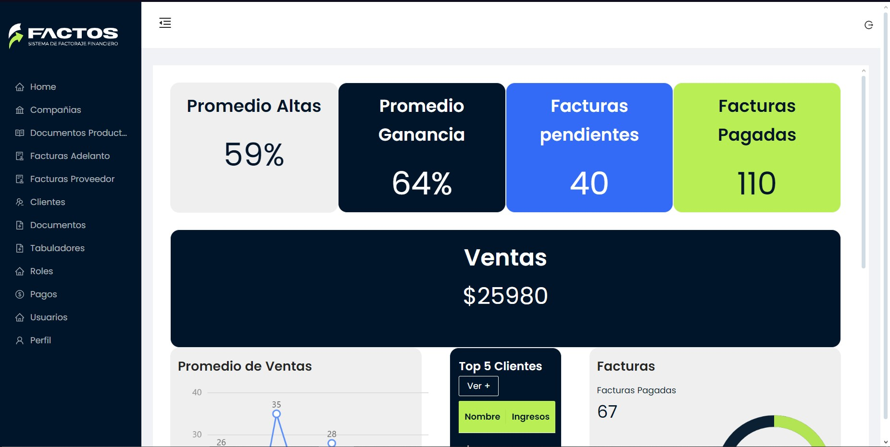
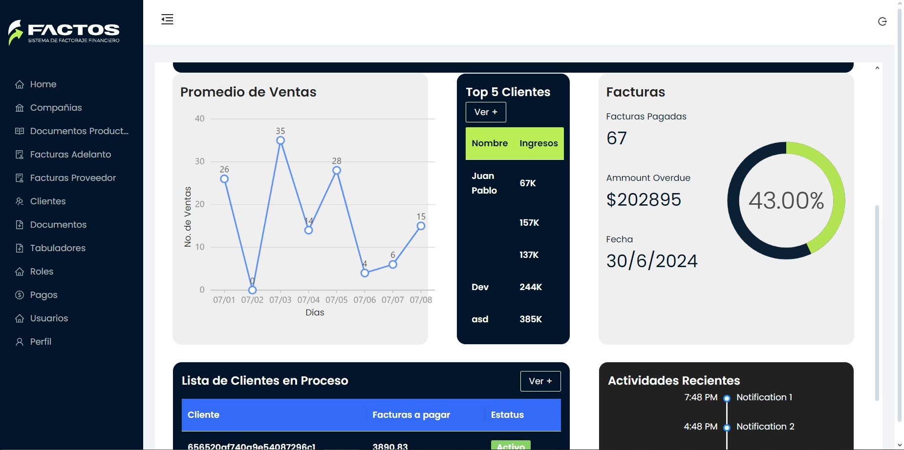
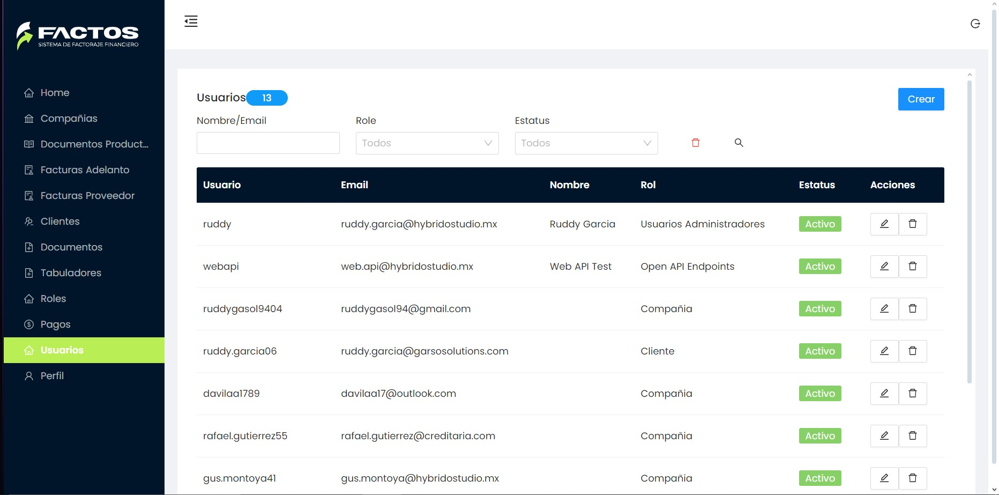
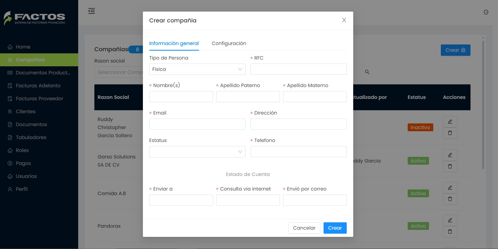
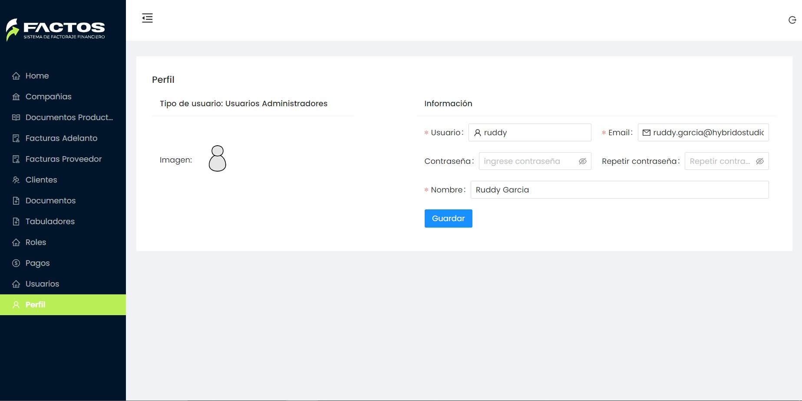

## ✨ GitHub Stats ✨

&nbsp;

### Contact 💼

Correo 

 
Linkedin 

