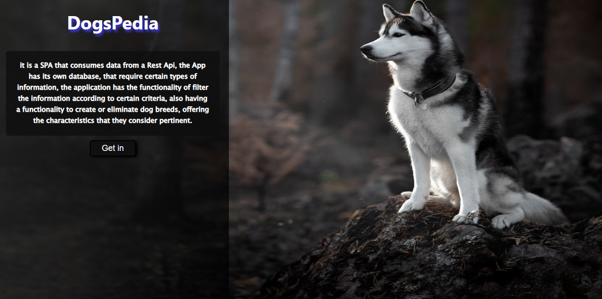
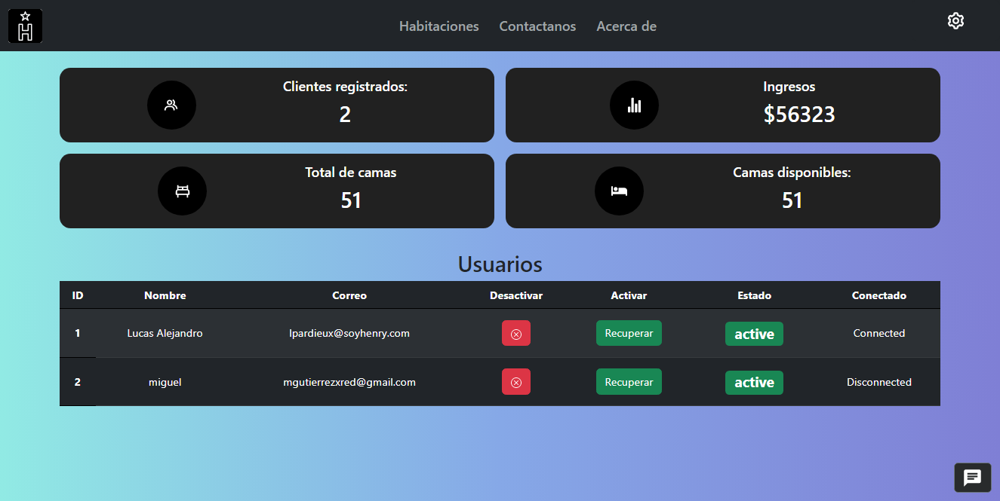
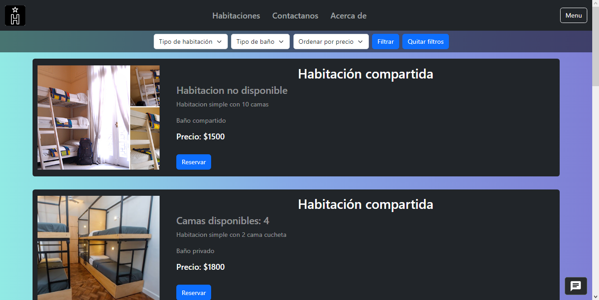
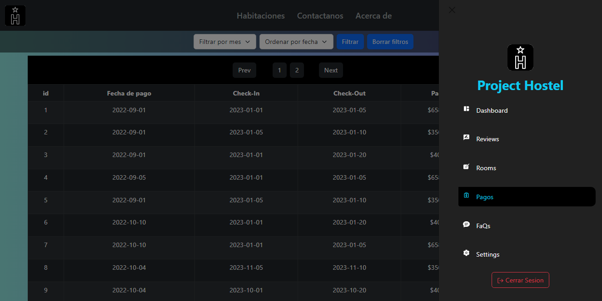

<h1 align="center">
 Full Stack Developer 
</h1>

👋 hello! My name is Miguel, I just graduated from Henry

I have always been interested in the world of technology since I was little, since I always had a fascination for video games🕹 and computers💾, the Cybersecurity sector caught my attention, it became a hobby, so I began my studies self-taught As I learned, I became interested in programming. I loved the idea of ​​having infinite possibilities and being able to create what I imagined only with code.

I took Henry's intensive bootcamp📚, to introduce myself to the tech world professionally, so I took the Full Stack Developer career seriously ✍ which was not easy, but I feel proud of what I can do now💪, of the projects you do and the experiences you take

Why choose me? 🙋‍♂️
♦ I believe that I excel at problem solving, never stop learning, and am able to adapt to different roles on a team as needed.

## ✨ Skills ✨

## ✨ Projects ✨

<a href="https://github.com/kripto-c/Proyecto-individual-29C">🔥 DogPedia 🔥</a>
 
<a href="https://dogpedia-henna.vercel.app">🐶 Visit site 🐶</a>

<a href="https://github.com/kripto-c/HostelProject">🏢 Hostel Project 🏢</a>
 
<a href="https://hostel-project.vercel.app">🏝 Visit site 🏖</a>

## ✨ GitHub Stats ✨

&nbsp;

### Contact 💼

Correo 

 
Linkedin 

